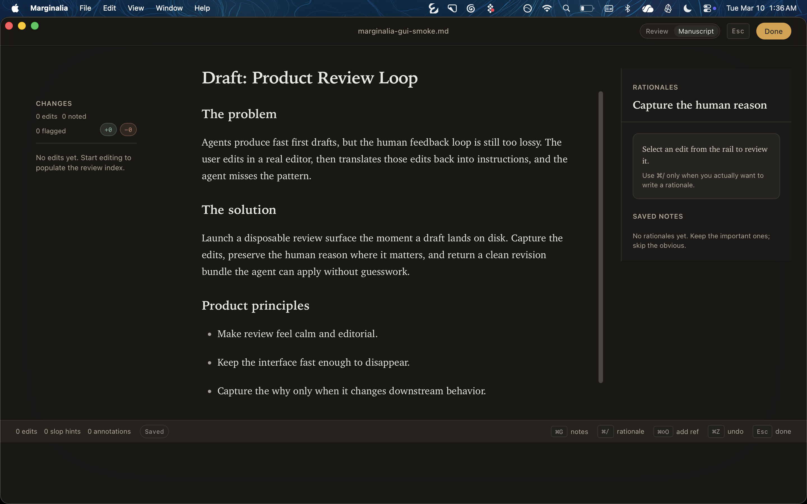

# Marginalia

Marginalia is a disposable macOS review app for agent-written drafts.

It opens when a draft hits disk, lets you edit inline, captures short rationales only when they matter, then returns a clean bundle the agent can use immediately.



_Desktop review surface: change rail, manuscript editor, and focused rationale column._

## Why it exists

The normal loop is lossy:

1. The agent writes a draft.
2. You edit it somewhere else.
3. You explain those edits back to the agent.
4. The agent guesses what to repeat.

Marginalia removes the translation step. Your edits become the feedback channel.

## What it does

- Opens one markdown file in a native review window.
- Shows a stable change rail, a manuscript editor, and a focused rationale surface.
- Computes diffs from rendered plain text so edits read like editorial changes, not character noise.
- Lets you add change-bound rationales with `⌘/` and session notes with `⌘G`.
- Persists recovery snapshots and marks ambiguous note remaps as stale instead of silently moving them.
- Writes a 7-file review bundle on close.

## Install

Requires macOS and `jq`.

```bash
brew install jq
curl -fsSL https://raw.githubusercontent.com/samay58/marginalia/main/scripts/install.sh | bash
```

If the CLI lands in `~/.local/bin`, add that directory to `PATH`.

## Hook setup

Marginalia is designed to run from a post-write hook.

Global Claude Code hook:

```bash
marginalia init --global
```

Project-local hook:

```bash
marginalia init
```

Async hook mode:

```bash
marginalia init --async
```

Default trigger rules:

- files ending in `-draft.md`
- files containing `<!-- REVIEW -->`

If your CLI supports post-write hooks, call `marginalia open <file> --out <status-path>` and feed the resulting `summary_for_agent.md` back into the agent.

## Usage

Open a file directly:

```bash
marginalia open ./draft.md
```

Open with explicit bundle and status output paths:

```bash
marginalia open ./draft.md \
  --bundle-dir ~/.marginalia/bundles \
  --out /tmp/marginalia.status.json
```

Optional writing principles:

```bash
marginalia open ./draft.md --principles ~/WRITING.md
```

## Bundle contract

Bundles are written to:

`~/.marginalia/bundles/[timestamp]_[filename]/`

Each bundle contains:

- `original.md`
- `final.md`
- `changes.json`
- `annotations.json`
- `changes.patch`
- `provenance.json`
- `summary_for_agent.md`

`summary_for_agent.md` is the primary agent input. The other files exist for exactness, automation, and debugging.

## Shortcuts

| Key | Action |
| --- | --- |
| `Esc` | Finalize review and write bundle |
| `⌘ Enter` | Finalize review |
| `⌘ /` | Start a rationale for the nearest edit |
| `⌘ G` | Toggle session notes |
| `⌘ O` | Open a different draft |
| `⌘ ⇧ O` | Toggle references |
| `⌘ Z` | Undo |
| `⌘ ⇧ Z` | Redo |

## Development

```bash
pnpm install
pnpm tauri dev
pnpm run check:diff
pnpm run check:annotations
pnpm run check:semantic
pnpm run check:bundle
pnpm run check:hook
pnpm run check:lint
pnpm run check
pnpm run build
```

Notes:

- `pnpm dev` serves the marketing site.
- `pnpm tauri dev` runs the desktop review app at `/review`.
- `pnpm tauri:build:app` builds the `.app`.
- `pnpm tauri:build:dmg` builds the DMG release artifact.

## Docs

- [docs/README.md](docs/README.md)
- [docs/architecture.md](docs/architecture.md)
- [docs/reliability.md](docs/reliability.md)
- [docs/maintainers/release.md](docs/maintainers/release.md)

## License

MIT
